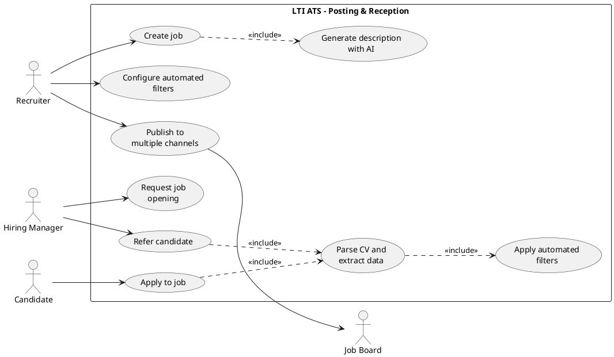
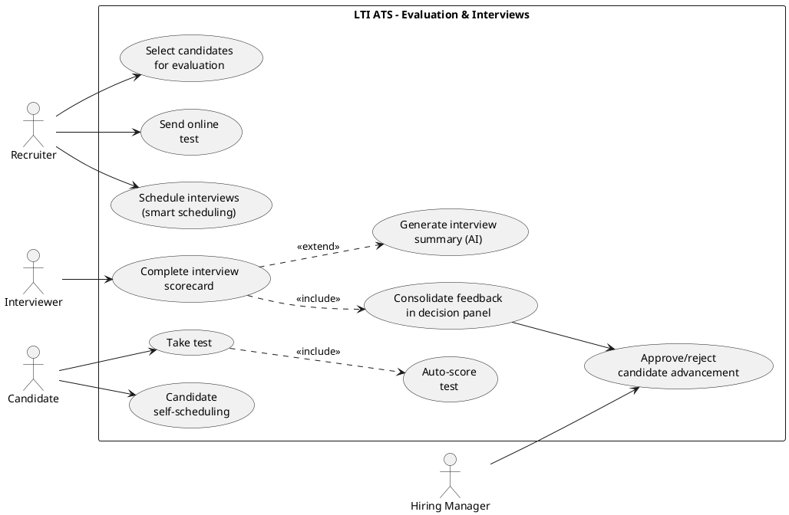
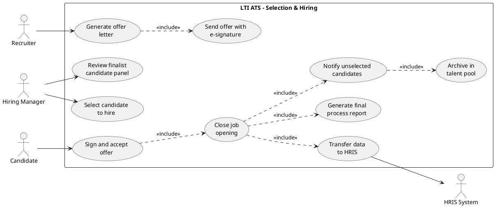

# LTI — ATS System Design
## v1.0

---

## 1. Software Description

### 1.1 What Is LTI and Its Product?

LTI is an HR technology startup whose main product is **LTI ATS**, a next-generation Applicant Tracking System built for HR teams that need to fill positions quickly, collaboratively, and driven by data. Unlike traditional ATS platforms that function as glorified CV databases, LTI ATS embeds artificial intelligence into every stage of the hiring pipeline — from job description drafting to the final hiring decision — eliminating operational friction and reducing bias in candidate evaluation.

LTI was founded in response to an ATS market dominated by expensive platforms with opaque pricing (Greenhouse charges between $6,500 and $70,000+ per year without publishing prices), solutions that require weeks of implementation, and tools whose AI is limited to basic keyword matching.

### 1.2 Value Proposition

**Native AI assistant across the entire pipeline.** While competitors like Greenhouse and Lever offer AI as optional premium add-ons, LTI ATS integrates it from the base plan: job description writing, intelligent CV parsing, semantic candidate matching, automatic interview summaries, and bias detection in evaluations.

**Real-time collaboration.** A centralized workspace where recruiters, hiring managers, and interviewers share feedback, scorecards, and notes with full traceability. Much like Figma transformed design collaboration, LTI ATS brings that same immediacy to the hiring process.

**Transparent and startup-friendly pricing.** Unlike Greenhouse (no public pricing, $1,000–$15,000 implementation fees on top), Lever ($12,000+/year base), and Workable ($169–$599/month plus extras), LTI ATS offers clear pricing from day one, with a functional free tier for small teams.

**Time-to-hire as the core metric.** The entire product design is oriented around reducing time-to-fill. Smart automations, frictionless scheduling, and a visual pipeline that identifies bottlenecks in real time.

### 1.3 Competitive Advantages

| Dimension | Greenhouse | Lever | Workable | **LTI ATS** |
|---|---|---|---|---|
| **Pricing** | Opaque, from $6,500/yr | Opaque, from $12,000/yr | $169–$599/mo + extras | Transparent, freemium + clear tiers |
| **Integrated AI** | Expert plan only | AI Interview Companion (add-on) | Basic AI sourcing | Native AI at every stage |
| **Onboarding** | 4–8 weeks | 2–4 weeks | 1–2 weeks | < 1 week (self-service) |
| **Collaboration** | Scorecards + feedback | Shared pipeline | Notes + evaluations | Real-time with presence and notifications |
| **Online tests** | Via integrations (Codility, HackerRank) | Via integrations | Native assessments (add-on $59/mo) | Native tests with AI auto-generation |
| **Analytics** | Robust but rigid | Visual Insights (limited) | Premium plans only | Actionable dashboards from base plan |

### 1.4 Core Features

**Job Posting Management.** Create, edit, and publish job openings with an AI assistant for writing inclusive, conversion-optimized descriptions. Reusable templates by role and department.

**Multichannel Publishing.** Simultaneous distribution to job boards (LinkedIn, Indeed, Glassdoor), corporate career sites (embeddable widget), social media, and internal referral programs. Source-of-hire tracking per channel.

**Candidate Pipeline.** Kanban view of the selection process per job opening. Automatic CV parsing with extraction of skills, experience, and contact data. Semantic candidate-job matching with explainable scores. Automated filters (knockout questions, duplicate detection, blacklist).

**Assessments and Tests.** Create technical and psychometric evaluations with a question bank or AI-assisted generation. Automatic scoring with configurable thresholds.

**Smart Scheduling.** Interview coordination integrated with Google Calendar / Outlook. Auto-scheduling based on panel availability. Candidate self-scheduling with configurable time slots.

**Collaboration and Feedback.** Structured scorecards by competency. Real-time interview notes. Decision panel with voting and consolidated feedback. Complete interaction history per candidate.

**Analytics and Reporting.** Dashboards for time-to-hire, source effectiveness, pipeline conversion rates, and diversity & inclusion. Proactive alerts for bottlenecks.

**Hiring and Onboarding.** Offer letter generation from templates. Integrated e-signatures. Handoff to HRIS systems via API.

### 1.5 Lean Canvas

```text
┌──────────────────────┬───────────────────────┬─────────────────────┐
│     PROBLEM          │   SOLUTION            │  UNIQUE VALUE       │
│                      │                       │  PROPOSITION        │
│ 1. Current ATS are   │ 1. Native AI across   │                     │
│    expensive with    │    the full pipeline  │ The first ATS with  │
│    opaque pricing    │    (writing, matching,│ AI built into every │
│ 2. Slow implementa-  │    evaluation)        │ pipeline stage,     │
│    tion (4-8 weeks)  │ 2. Self-service with  │ transparent pricing,│
│ 3. AI limited to     │    onboarding < 1 wk  │ and setup in        │
│    keyword matching  │ 3. Freemium pricing   │ minutes — not       │
│ 4. Fragmented collab │    with clear tiers   │ weeks.              │
│    between recruiter │ 4. Real-time collab   │                     │
│    and hiring mgr    │    with traceability  │                     │
│                      │                       │                     │
├──────────────────────┼───────────────────────┼─────────────────────┤
│  KEY METRICS         │                       │  UNFAIR ADVANTAGE   │
│                      │                       │                     │
│ - Time-to-hire       │   CHANNELS            │ AI model trained on │
│ - Active openings    │                       │ anonymized data from│
│ - Stage conversion   │ - PLG (freemium)      │ real hiring         │
│   rate               │ - Content marketing   │ processes, improving│
│ - Candidate NPS      │   (SEO/blog)          │ with every hire.    │
│ - Recruiter NPS      │ - Job board           │ Network effect:     │
│ - Revenue (MRR/ARR)  │   integrations        │ more data → better  │
│ - Churn rate         │ - HR consultancy      │ AI → more customers.│
│                      │   partnerships        │                     │
│                      │ - Referral program    │                     │
│                      │                       │                     │
├──────────────────────┼───────────────────────┼─────────────────────┤
│  CUSTOMER SEGMENTS   │                       │  REVENUE STRUCTURE  │
│                      │  COST STRUCTURE       │                     │
│ Early adopters:      │                       │ - Free: 2 active    │
│ - Tech startups      │ - Cloud infra (AWS/   │   openings, 1 user  │
│   (10-200 emp)       │   GCP)                │ - Pro: $79/mo/user  │
│ - Growing scale-ups  │ - Development team    │   unlimited jobs    │
│   (200-1000 emp)     │ - LLM/AI costs        │ - Business:         │
│ - TA teams at mid-   │   (APIs, fine-tuning) │   $149/mo/user      │
│   size companies     │ - Marketing & sales   │   AI + analytics    │
│ - Staffing agencies  │ - Customer support    │ - Enterprise:       │
│                      │                       │   custom pricing    │
│                      │                       │   SSO, SLA, API     │
└──────────────────────┴───────────────────────┴─────────────────────┘
```

---

## 2. Main Use Cases

### Use Case 1: Job Posting and Candidate Reception

**Actors:** Recruiter, Hiring Manager, AI System, Job Boards (external), Candidate

**Preconditions:** The Recruiter has an active account on LTI ATS. The Hiring Manager has defined the position requirements.

**Main Flow:**

1. The Hiring Manager requests a new job opening.
2. The Recruiter creates the job in LTI ATS specifying title, department, location, and contract type.
3. The AI system generates a draft job description based on the title and historical data from similar openings.
4. The Recruiter reviews, adjusts, and approves the description.
5. The Recruiter configures knockout questions and automated filter criteria.
6. The Recruiter selects the publishing channels (job boards, career site, social media, referrals).
7. The system publishes the job simultaneously across all selected channels.
8. Candidates apply through any of the channels.
9. The system parses CVs, extracts structured data, and creates the candidate profile.
10. The system applies automated filters (knockout questions, skill matching, duplicates/blacklist).
11. Candidates who pass the filters appear in the pipeline for Recruiter review.

**Postconditions:** The job is published and filtered candidates are available for manual review.

**Alternative Flows:**
- 3a. The Recruiter opts to write the description manually without the AI assistant.
- 8a. An internal employee refers a candidate through the referral module.
- 10a. A candidate is automatically rejected and receives a notification with an option to join the talent pool.



---

### Use Case 2: Collaborative Evaluation and Interviews

**Actors:** Recruiter, Hiring Manager, Interviewer, Candidate, AI System

**Preconditions:** There are candidates in the pipeline who have passed automated filters and the Recruiter's initial review.

**Main Flow:**

1. The Recruiter reviews filtered candidates and selects those advancing to evaluation.
2. The Recruiter invites the candidate to complete an online test.
3. The Candidate takes the test within the platform.
4. The system auto-scores and updates the candidate profile with results.
5. The Recruiter reviews results and decides which candidates advance to interviews.
6. The Recruiter schedules interviews using smart scheduling (calendar integration).
7. The Candidate receives the invitation and confirms (or selects a slot via self-scheduling).
8. The Interviewer conducts the interview and completes the scorecard with competency-based evaluation.
9. The system consolidates feedback from all interviewers into a decision panel.
10. The Hiring Manager reviews the panel and approves/rejects the candidate's advancement to the next stage.

**Postconditions:** Evaluated candidates have consolidated scores and recorded decisions for each stage.

**Alternative Flows:**
- 2a. The Recruiter skips the test and proceeds directly to scheduling interviews.
- 6a. No common availability exists; the system suggests alternative time slots.
- 8a. The system generates an AI-assisted interview summary from notes or transcription.



---

### Use Case 3: Final Selection and Hiring

**Actors:** Recruiter, Hiring Manager, Candidate, System

**Preconditions:** The candidate has completed all interview stages with positive evaluations. The decision panel shows favorable consolidated feedback.

**Main Flow:**

1. The Hiring Manager reviews the decision panel with all finalist candidates.
2. The Hiring Manager selects the candidate to hire.
3. The Recruiter generates the offer letter from a configurable template (salary, benefits, start date).
4. The system sends the offer to the Candidate via email with an e-signature option.
5. The Candidate reviews and accepts the offer by signing electronically.
6. The system updates the candidate's status to "Hired" and closes the job opening.
7. The system notifies unselected candidates with optional feedback.
8. Rejected candidates are archived in the talent pool for future openings.
9. The system generates the final process report (time-to-hire, source, conversion rates).
10. The hired candidate's data is transferred to the HRIS system via API (onboarding handoff).

**Postconditions:** The candidate is hired, the job is closed, rejected candidates are notified, and process metrics are recorded.

**Alternative Flows:**
- 5a. The Candidate rejects the offer → the Recruiter can renegotiate or select the next finalist.
- 5b. The Candidate does not respond within the deadline → the system sends an automatic reminder.
- 7a. The Hiring Manager opts not to send feedback to rejected candidates.



---

## 3. Data Model

### 3.1 Entities, Attributes, and Types

#### Company
| Attribute | Type | Description |
|---|---|---|
| id | UUID | Unique identifier |
| name | VARCHAR(255) | Company name |
| industry | VARCHAR(100) | Industry/sector |
| size_range | ENUM | Employee range (1-50, 51-200, 201-1000, 1000+) |
| website_url | VARCHAR(500) | Website URL |
| logo_url | VARCHAR(500) | Logo URL |
| plan | ENUM | Subscription plan (free, pro, business, enterprise) |
| created_at | TIMESTAMP | Creation date |
| updated_at | TIMESTAMP | Last update |

#### User
| Attribute | Type | Description |
|---|---|---|
| id | UUID | Unique identifier |
| company_id | UUID (FK) | Reference to Company |
| email | VARCHAR(255) | Unique email |
| password_hash | VARCHAR(255) | Password hash |
| first_name | VARCHAR(100) | First name |
| last_name | VARCHAR(100) | Last name |
| role | ENUM | Role (admin, recruiter, hiring_manager, interviewer, viewer) |
| avatar_url | VARCHAR(500) | Avatar URL |
| is_active | BOOLEAN | Active/inactive status |
| last_login_at | TIMESTAMP | Last login |
| created_at | TIMESTAMP | Creation date |

#### Department
| Attribute | Type | Description |
|---|---|---|
| id | UUID | Unique identifier |
| company_id | UUID (FK) | Reference to Company |
| name | VARCHAR(255) | Department name |
| head_user_id | UUID (FK) | Department head |

#### Job
| Attribute | Type | Description |
|---|---|---|
| id | UUID | Unique identifier |
| company_id | UUID (FK) | Reference to Company |
| department_id | UUID (FK) | Reference to Department |
| created_by_id | UUID (FK) | Recruiter who created it |
| hiring_manager_id | UUID (FK) | Responsible Hiring Manager |
| title | VARCHAR(255) | Job title |
| description | TEXT | Full description |
| requirements | TEXT | Position requirements |
| location | VARCHAR(255) | Location |
| location_type | ENUM | Type (onsite, remote, hybrid) |
| employment_type | ENUM | Contract type (full_time, part_time, contract, internship) |
| salary_min | DECIMAL(12,2) | Minimum salary |
| salary_max | DECIMAL(12,2) | Maximum salary |
| salary_currency | VARCHAR(3) | Currency (USD, EUR, MXN) |
| status | ENUM | Status (draft, open, paused, closed, cancelled) |
| pipeline_template_id | UUID (FK) | Pipeline template |
| published_at | TIMESTAMP | Publication date |
| closed_at | TIMESTAMP | Closing date |
| created_at | TIMESTAMP | Creation date |
| updated_at | TIMESTAMP | Last update |

#### JobPublication
| Attribute | Type | Description |
|---|---|---|
| id | UUID | Unique identifier |
| job_id | UUID (FK) | Reference to Job |
| channel | ENUM | Channel (linkedin, indeed, company_website, referral, other) |
| external_job_id | VARCHAR(255) | ID on external platform |
| status | ENUM | Status (active, paused, expired) |
| published_at | TIMESTAMP | Publication date |
| expires_at | TIMESTAMP | Expiration date |

#### Candidate
| Attribute | Type | Description |
|---|---|---|
| id | UUID | Unique identifier |
| company_id | UUID (FK) | Reference to Company |
| email | VARCHAR(255) | Email — UNIQUE per company: `UNIQUE (company_id, email)` |
| first_name | VARCHAR(100) | First name |
| last_name | VARCHAR(100) | Last name |
| phone | VARCHAR(50) | Phone number — part of secondary dedupe index: `UNIQUE (company_id, first_name, last_name, phone)` |
| linkedin_url | VARCHAR(500) | LinkedIn profile |
| resume_url | VARCHAR(500) | Stored CV URL |
| resume_parsed_data | JSONB | Extracted CV data (skills, experience, education) |
| source | ENUM | Source (job_board, referral, direct, sourcing, career_site) |
| referred_by_user_id | UUID (FK) | Referring user (nullable) |
| is_blacklisted | BOOLEAN | Blacklisted |
| talent_pool_tags | VARCHAR[] | Talent pool segmentation tags |
| created_at | TIMESTAMP | Registration date |
| updated_at | TIMESTAMP | Last update |

#### JobApplication
| Attribute | Type | Description |
|---|---|---|
| id | UUID | Unique identifier |
| job_id | UUID (FK) | Reference to Job — part of application dedupe: `UNIQUE (job_id, candidate_id)` |
| candidate_id | UUID (FK) | Reference to Candidate — enforces one application per candidate per job |
| publication_id | UUID (FK) | Source channel — included in channel-scoped variant: see constraints note |
| current_stage_id | UUID (FK) | Current pipeline stage |
| status | ENUM | Status (active, hired, rejected, withdrawn) |
| ai_match_score | DECIMAL(5,2) | AI matching score (0-100) |
| knockout_answers | JSONB | Knockout question answers |
| knockout_passed | BOOLEAN | Passed knockout questions |
| rejection_reason | VARCHAR(255) | Rejection reason (nullable) |
| applied_at | TIMESTAMP | Application date |
| updated_at | TIMESTAMP | Last update |

#### PipelineStage
| Attribute | Type | Description |
|---|---|---|
| id | UUID | Unique identifier |
| pipeline_template_id | UUID (FK) | Pipeline template |
| name | VARCHAR(100) | Stage name |
| stage_type | ENUM | Type (applied, screening, test, interview, offer, hired) |
| order_index | INTEGER | Position in pipeline |
| is_auto_advance | BOOLEAN | Auto-advance if criteria met |

#### Interview
| Attribute | Type | Description |
|---|---|---|
| id | UUID | Unique identifier |
| application_id | UUID (FK) | Reference to JobApplication |
| stage_id | UUID (FK) | Pipeline stage |
| interview_type | ENUM | Type (phone_screen, technical, hiring_manager, cultural, final) |
| scheduled_at | TIMESTAMP | Scheduled date/time |
| duration_minutes | INTEGER | Duration in minutes |
| location | VARCHAR(255) | Location or video call link |
| status | ENUM | Status (scheduled, completed, cancelled, no_show) |
| ai_summary | TEXT | AI-generated summary (nullable) |
| created_at | TIMESTAMP | Creation date |

#### InterviewParticipant
| Attribute | Type | Description |
|---|---|---|
| id | UUID | Unique identifier |
| interview_id | UUID (FK) | Reference to Interview |
| user_id | UUID (FK) | Interviewer |
| role | ENUM | Interview role (lead, panel, observer) |
| confirmed | BOOLEAN | Attendance confirmation |

#### Scorecard
| Attribute | Type | Description |
|---|---|---|
| id | UUID | Unique identifier |
| interview_id | UUID (FK) | Reference to Interview |
| evaluator_id | UUID (FK) | Evaluating user |
| overall_rating | ENUM | Overall rating (strong_yes, yes, neutral, no, strong_no) |
| notes | TEXT | Interview notes |
| submitted_at | TIMESTAMP | Submission date |

#### ScorecardCriteria
| Attribute | Type | Description |
|---|---|---|
| id | UUID | Unique identifier |
| scorecard_id | UUID (FK) | Reference to Scorecard |
| criteria_name | VARCHAR(255) | Evaluated competency |
| rating | INTEGER | Score (1-5) |
| comment | TEXT | Competency comment |

#### Assessment (Online Tests)
| Attribute | Type | Description |
|---|---|---|
| id | UUID | Unique identifier |
| company_id | UUID (FK) | Reference to Company |
| title | VARCHAR(255) | Test name |
| description | TEXT | Description |
| assessment_type | ENUM | Type (technical, psychometric, coding, custom) |
| time_limit_minutes | INTEGER | Time limit |
| passing_score | DECIMAL(5,2) | Minimum passing score |
| questions | JSONB | Questions and options |
| created_by_id | UUID (FK) | Creator |
| created_at | TIMESTAMP | Creation date |

#### AssessmentResult
| Attribute | Type | Description |
|---|---|---|
| id | UUID | Unique identifier |
| assessment_id | UUID (FK) | Reference to Assessment |
| application_id | UUID (FK) | Reference to JobApplication |
| score | DECIMAL(5,2) | Score obtained |
| passed | BOOLEAN | Passed/failed |
| answers | JSONB | Candidate answers |
| started_at | TIMESTAMP | Test start |
| completed_at | TIMESTAMP | Test end |

#### Offer
| Attribute | Type | Description |
|---|---|---|
| id | UUID | Unique identifier |
| application_id | UUID (FK) | Reference to JobApplication |
| created_by_id | UUID (FK) | Recruiter who generated the offer |
| salary | DECIMAL(12,2) | Offered salary |
| currency | VARCHAR(3) | Currency |
| start_date | DATE | Proposed start date |
| benefits | TEXT | Benefits description |
| status | ENUM | Status (draft, sent, accepted, rejected, expired) |
| document_url | VARCHAR(500) | Offer document URL |
| signed_at | TIMESTAMP | Signature date (nullable) |
| sent_at | TIMESTAMP | Sent date |
| expires_at | TIMESTAMP | Expiration date |
| created_at | TIMESTAMP | Creation date |

#### Notification
| Attribute | Type | Description |
|---|---|---|
| id | UUID | Unique identifier |
| user_id | UUID (FK) | Recipient |
| type | ENUM | Type (new_application, interview_scheduled, feedback_pending, offer_response) |
| title | VARCHAR(255) | Title |
| message | TEXT | Content |
| is_read | BOOLEAN | Read status |
| resource_type | VARCHAR(50) | Related resource type |
| resource_id | UUID | Related resource ID |
| created_at | TIMESTAMP | Creation date |

### 3.2 Entity Relationship Diagram (ER)

```text
┌──────────┐       ┌──────────────┐       ┌─────────────┐
│ Company  │1────N │    User      │       │  Department │
│          │1────N │              │       │             │
│          │       └──────────────┘       │             │
│          │1───────────────────────────N │             │
└──────┬───┘                              └─────┬───────┘
       │1                                       │1
       │                                        │
       N                                        N
┌──────┴────────────────────────────────────────┴───┐
│                        Job                        │
│  (created_by → User, hiring_manager → User)       │
└──────┬──────────────────────────────┬─────────────┘
       │1                             │1
       │                              │
       N                              N
┌──────┴───────┐              ┌───────┴──────────┐
│JobPublication│              │  PipelineStage   │
└──────────────┘              └───────┬──────────┘
                                      │1
       ┌──────────┐                   │
       │Candidate │1───N──────────────┤
       │          │            ┌──────┴──────────┐
       └──────────┘            │ JobApplication  │
                               │ (stage → Stage) │
                               └──┬──────┬───┬───┘
                                  │1     │1  │1
                    ┌─────────────┘      │   └─────────────┐
                    N                    N                   N
              ┌─────┴─────┐      ┌──────┴──────┐   ┌───────┴────┐
              │ Interview │      │ Assessment  │   │  Offer     │
              │           │      │ Result      │   │            │
              └──┬────┬───┘      └─────────────┘   └────────────┘
                 │1   │1
                 │    N
                 N    ┌────────────────────┐
   ┌─────────────┴┐   │InterviewParticipant│
   │  Scorecard   │   │  (user → User)     │
   │(evaluator→   │   └────────────────────┘
   │     User)    │
   └──────┬───────┘
          │1
          N
   ┌──────┴──────────┐
   │ScorecardCriteria│
   └─────────────────┘

   Assessment ←── 1:N ── AssessmentResult
   Notification ── (user → User)
```

### 3.3 Key Relationships

- **Company** 1:N **User** — A company has many users.
- **Company** 1:N **Department** — A company has many departments.
- **Company** 1:N **Job** — A company has many job openings.
- **Company** 1:N **Candidate** — Candidates are linked to the tenant (company).
- **Company** 1:N **Assessment** — Tests belong to the company.
- **Department** 1:N **Job** — A department has many job openings.
- **Job** 1:N **JobPublication** — A job is published across multiple channels.
- **Job** 1:N **JobApplication** — A job receives many applications.
- **Job** N:1 **User** (created_by) — A recruiter creates the job.
- **Job** N:1 **User** (hiring_manager) — A hiring manager is responsible.
- **Candidate** 1:N **JobApplication** — A candidate can apply to multiple jobs.
- **JobApplication** N:1 **PipelineStage** — An application is at one stage.
- **JobApplication** 1:N **Interview** — An application can have multiple interviews.
- **JobApplication** 1:N **AssessmentResult** — An application can have multiple test results.
- **JobApplication** 1:1 **Offer** — An application generates at most one offer.
- **Interview** 1:N **InterviewParticipant** — An interview has multiple participants.
- **Interview** 1:N **Scorecard** — An interview generates multiple scorecards (one per evaluator).
- **Scorecard** 1:N **ScorecardCriteria** — A scorecard has multiple evaluated criteria.
- **Assessment** 1:N **AssessmentResult** — A test can be taken by multiple candidates.
- **User** 1:N **Notification** — A user receives many notifications.

---

### 3.4 Uniqueness Constraints & Deduplication

DDL-level UNIQUE constraints are required on two tables to prevent duplicate rows that application-layer checks alone cannot guarantee under concurrent inserts.

#### Candidate deduplication

```sql
-- Primary deduplication: one email address per tenant
ALTER TABLE candidate
  ADD CONSTRAINT uq_candidate_company_email
  UNIQUE (company_id, email);

-- Secondary deduplication: same name + phone within a tenant
-- Catches re-submissions where the candidate uses a different email
ALTER TABLE candidate
  ADD CONSTRAINT uq_candidate_company_name_phone
  UNIQUE (company_id, first_name, last_name, phone);
```

> **Migration note:** Before creating these indexes, merge or archive existing duplicates within the same `company_id`:
> 1. Identify duplicates: `SELECT company_id, email, COUNT(*) FROM candidate GROUP BY company_id, email HAVING COUNT(*) > 1;`
> 2. For each duplicate set, keep the earliest `created_at` record; update all `JobApplication` rows that reference the discarded `candidate_id` to point to the surviving one; then delete the duplicates.
> 3. Repeat the same process for the `(company_id, first_name, last_name, phone)` group before adding the second constraint.

#### JobApplication deduplication

```sql
-- One application per candidate per job (cross-channel)
ALTER TABLE job_application
  ADD CONSTRAINT uq_jobapplication_job_candidate
  UNIQUE (job_id, candidate_id);
```

If the business rule allows one application **per channel** (e.g., a candidate may re-apply through a different job board for the same job), replace the constraint above with the channel-scoped variant:

```sql
-- One application per candidate per job per publication channel
ALTER TABLE job_application
  ADD CONSTRAINT uq_jobapplication_job_candidate_publication
  UNIQUE (job_id, candidate_id, publication_id);
```

> **Migration note:** Before adding the constraint, resolve existing duplicates:
> 1. Identify: `SELECT job_id, candidate_id, COUNT(*) FROM job_application GROUP BY job_id, candidate_id HAVING COUNT(*) > 1;`
> 2. For each duplicate pair, keep the record with the earlier `applied_at`; soft-delete or set `status = 'withdrawn'` on the others rather than hard-deleting, to preserve audit history.
> 3. After deduplication, create the unique index `CONCURRENTLY` in production to avoid table locks.

---

## 4. High-Level System Design

### 4.1 Architecture Description

LTI ATS follows an **event-driven microservices architecture** deployed cloud-native. This decision addresses three key product needs: independent scalability of components with different load profiles (the CV parsing service has very different peaks than scheduling), resilience against partial failures (if the AI engine degrades, the core ATS keeps working), and development velocity for LTI's growing team.

**Presentation Layer.** A React SPA (Single Page Application) that communicates exclusively with the API Gateway. It also includes a candidate portal (simplified application) and embeddable widgets for client career sites.

**API Gateway.** Single entry point handling authentication (JWT + OAuth 2.0), rate limiting, routing to microservices, and response aggregation. Implemented with Kong or AWS API Gateway.

**Core Microservices.** Each service is independent, has its own database (database-per-service), and communicates asynchronously via event bus for non-critical operations and synchronously (REST/gRPC) for direct queries:

- **Identity Service** — Authentication, authorization, user and role management (multi-tenant).
- **Job Service** — CRUD for job openings, templates, pipeline stages.
- **Publication Service** — Integration with external job boards, publication tracking.
- **Application Service** — Application intake, pipeline management, stage transitions.
- **Candidate Service** — Candidate profile, talent pool, deduplication.
- **Assessment Service** — Test creation and execution, automatic scoring.
- **Interview Service** — Scheduling, calendar integrations, scorecards, feedback.
- **Offer Service** — Offer generation, e-signatures, response tracking.
- **AI Service** — Orchestrator for AI capabilities: CV parsing, semantic matching, text generation, interview summaries.
- **Analytics Service** — Metrics aggregation, dashboards, reports.
- **Notification Service** — Transactional emails, in-app notifications, webhooks.

**Event Bus.** Apache Kafka (or Amazon EventBridge) as the asynchronous communication backbone. Key events: `application.received`, `candidate.stage_changed`, `interview.completed`, `offer.sent`, `offer.accepted`.

**Storage.** PostgreSQL as the primary database per service. Redis for caching and sessions. Amazon S3 (or equivalent) for files (CVs, offer documents). Elasticsearch for full-text candidate search.

**AI Services.** The AI Service acts as a proxy/orchestrator to LLM models (OpenAI API, or fine-tuned proprietary model). It includes an embedding layer for semantic candidate search using a vector store (pgvector or Pinecone).

**Cross-cutting Infrastructure.** Observability (logs, metrics, traces with OpenTelemetry), CI/CD (GitHub Actions + ArgoCD), containers (Docker + Kubernetes), and data-level multi-tenancy (tenant isolation by company_id with Row-Level Security in PostgreSQL).

### 4.2 High-Level Architecture Diagram

```text
┌───────────────────────────────────────────────────────────────────────────┐
│                           CLIENTS                                         │
│                                                                           │
│   ┌──────────────┐   ┌─────────────────┐   ┌────────────────────┐         │
│   │  React SPA   │   │ Candidate Portal│   │ Career Site Widget │         │
│   │  (Recruiter/ │   │   (Candidate)   │   │   (Embeddable)     │         │
│   │   HM / Admin)│   │                 │   │                    │         │
│   └──────┬───────┘   └────────┬────────┘   └─────────┬──────────┘         │
│          │                    │                       │                   │
└──────────┼────────────────────┼───────────────────────┼───────────────────┘
           │                    │                       │
           ▼                    ▼                       ▼
┌──────────────────────────────────────────────────────────────────────────┐
│                          API GATEWAY                                     │
│            (Auth JWT/OAuth · Rate Limit · Routing · CORS)                │
└──────────────┬─────────┬──────────┬──────────┬──────────┬────────────────┘
               │         │          │          │          │
       ┌───────┴───┐ ┌───┴─────┐ ┌──┴───┐ ┌────┴────┐ ┌──┴──────┐
       │ Identity  │ │  Job    │ │Appli-│ │  Inter- │ │  Offer  │
       │ Service   │ │Service  │ │cation│ │  view   │ │ Service │
       │           │ │         │ │Serv. │ │  Serv.  │ │         │
       │ - Auth    │ │ - CRUD  │ │      │ │         │ │ - Gen.  │
       │ - Users   │ │ - Pipe- │ │- Pipe│ │- Sched. │ │ - eSig  │
       │ - Roles   │ │   line  │ │- Filt│ │- Score  │ │ - Track │
       │ - Tenant  │ │ - Templ │ │- Move│ │- Feedb. │ │         │
       └─────┬─────┘ └────┬────┘ └──┬───┘ └───┬─────┘ └────┬────┘
             │            │         │         │            │
             │      ┌─────┴───┐  ┌──┴──────┐  │    ┌───────┴──────┐
             │      │  Publi- │  │Candidate│  │    │ Assessment   │
             │      │  cation │  │ Service │  │    │  Service     │
             │      │  Service│  │         │  │    │              │
             │      │         │  │- Profile│  │    │- Tests       │
             │      │- Boards │  │- Talent │  │    │- Scoring     │
             │      │- Social │  │  Pool   │  │    │- Questions   │
             │      │- Track  │  │- Dedup  │  │    │              │
             │      └────┬────┘  └────┬────┘  │    └─────┬────────┘
             │           │            │       │          │
     ════════╪═══════════╪════════════╪═══════╪══════════╪════════════
             │           │            │       │          │
             ▼           ▼            ▼       ▼          ▼
┌───────────────────────────────────────────────────────────────────────┐
│                     EVENT BUS (Kafka / EventBridge)                   │
│                                                                       │
│  Events: application.received · candidate.stage_changed ·             │
│          interview.completed · offer.sent · offer.accepted            │
└────────┬─────────────────────────────────┬────────────────────────────┘
         │                                 │
    ┌────┴──────────┐             ┌────────┴──────────┐
    │  AI Service   │             │ Notification Svc  │
    │               │             │                   │
    │ - CV Parsing  │             │ - Email (SES)     │
    │ - Matching    │             │ - In-app          │
    │ - Text Gen    │             │ - Webhooks        │
    │ - Summarize   │             │                   │
    └────┬──────────┘             └───────────────────┘
         │
    ┌────┴──────────┐       ┌────────────────────────┐
    │  LLM / ML     │       │   Analytics Service    │
    │  (OpenAI API  │       │                        │
    │   / fine-tuned│       │ - Dashboards           │
    │   model)      │       │ - Time-to-hire         │
    │               │       │ - Source effectiveness │
    │  Vector Store │       │ - Pipeline conversion  │
    │  (pgvector)   │       │ - DEI metrics          │
    └───────────────┘       └────────────────────────┘

     ═══════════════════════════════════════════════════
                       STORAGE
     ┌───────────┐  ┌─────────┐  ┌──────┐  ┌────────┐
     │PostgreSQL │  │  Redis  │  │  S3  │  │Elastic │
     │(per svc,  │  │ (cache, │  │(CVs, │  │search  │
     │ RLS multi-│  │ session)│  │docs) │  │(search)│
     │ tenant)   │  │         │  │      │  │        │
     └───────────┘  └─────────┘  └──────┘  └────────┘
```

---

## 5. C4 Diagram

The deep dive focuses on the **Application Service**, as it is the central component orchestrating the candidate pipeline — the functional heart of any ATS.

### 5.1 Level 1 — System Context

```text
┌───────────────────────────────────────────────────────────┐
│                      PEOPLE                               │
│                                                           │
│  ┌───────────┐   ┌───────────┐   ┌───────────────┐        │
│  │ Recruiter │   │  Hiring   │   │  Candidate    │        │
│  │           │   │  Manager  │   │               │        │
│  └─────┬─────┘   └─────┬─────┘   └───────┬───────┘        │
│        │               │                 │                │
└────────┼───────────────┼─────────────────┼────────────────┘
         │               │                 │
         ▼               ▼                 ▼
  ┌──────────────────────────────────────────────────┐
  │             LTI ATS System                       │
  │                                                  │
  │  Manages the complete recruitment process:       │
  │  posting, application, evaluation,               │
  │  interviews, and hiring.                         │
  └──────────┬────────────────┬──────────────────────┘
             │                │
             ▼                ▼
     ┌───────────────┐  ┌──────────────────┐
     │  Job Boards   │  │   HRIS Systems   │
     │  (LinkedIn,   │  │   (Workday,      │
     │   Indeed...)  │  │    BambooHR...)  │
     └───────────────┘  └──────────────────┘
     ┌───────────────┐  ┌──────────────────┐
     │  Calendars    │  │  AI Provider     │
     │  (Google,     │  │  (OpenAI API)    │
     │   Outlook)    │  │                  │
     └───────────────┘  └──────────────────┘
```

### 5.2 Level 2 — Containers (within LTI ATS)

```text
┌─────────────────────────────────────────────────────────────────┐
│                        LTI ATS System                           │
│                                                                 │
│  ┌─────────────┐  ┌──────────────────┐  ┌───────────────────┐   │
│  │  React SPA  │  │ Candidate Portal │  │ Career Site Widget│   │
│  │  (frontend) │  │  (frontend)      │  │ (embed JS)        │   │
│  └──────┬──────┘  └────────┬─────────┘  └─────────┬─────────┘   │
│         │                  │                       │            │
│         └──────────────────┼───────────────────────┘            │
│                            ▼                                    │
│                   ┌────────────────┐                            │
│                   │  API Gateway   │                            │
│                   └───────┬────────┘                            │
│         ┌─────────┬───────┼───────┬───────────┬─────────┐       │
│         ▼         ▼       ▼       ▼           ▼         ▼       │
│  ┌──────────┐┌────────┐┌──────┐┌───────┐┌────────┐┌────────┐    │
│  │Identity  ││  Job   ││ APP  ││Candi- ││Interv. ││ Offer  │    │
│  │Service   ││Service ││ SVC  ││date   ││Service ││Service │    │
│  └──────────┘└────────┘│ ◄══  │└───────┘└────────┘└────────┘    │
│                        │ C4   │                                 │
│  ┌──────────┐┌────────┐│FOCUS │┌───────────┐┌──────────────┐    │
│  │Publicat. ││Assess- ││      ││ Analytics ││ Notification │    │
│  │Service   ││ment    ││      ││  Service  ││   Service    │    │
│  └──────────┘│Service │└──────┘└───────────┘└──────────────┘    │
│              └────────┘                                         │
│                            ┌──────────────┐                     │
│                            │  AI Service  │                     │
│                            └──────────────┘                     │
│                                                                 │
│         ┌───────────┐ ┌───────┐ ┌────┐ ┌──────────┐             │
│         │PostgreSQL │ │ Redis │ │ S3 │ │Elastic   │             │
│         └───────────┘ └───────┘ └────┘ └──────────┘             │
│                                                                 │
│                    ┌──────────────────┐                         │
│                    │  Event Bus       │                         │
│                    │  (Kafka)         │                         │
│                    └──────────────────┘                         │
└─────────────────────────────────────────────────────────────────┘
```

### 5.3 Level 3 — Components of the Application Service

```text
┌───────────────────────────────────────────────────────────────────────┐
│                       APPLICATION SERVICE                             │
│                                                                       │
│  ┌──────────────────────────────────────────────────────────────┐     │
│  │                    API Layer (REST)                          │     │
│  │                                                              │     │
│  │  POST /applications        — Receive new application         │     │
│  │  GET  /applications/:id    — Application detail              │     │
│  │  GET  /jobs/:id/applications — List applications for a job   │     │
│  │  PATCH /applications/:id/stage — Move to stage               │     │
│  │  PATCH /applications/:id/status — Change status              │     │
│  │  GET  /applications/:id/timeline — Activity history          │     │
│  └────────────────────────────────┬─────────────────────────────┘     │
│                                   │                                   │
│            ┌──────────────────────┼──────────────────────┐            │
│            │                      │                      │            │
│            ▼                      ▼                      ▼            │
│  ┌─────────────────┐  ┌──────────────────┐  ┌──────────────────────┐  │
│  │   Application   │  │   Pipeline       │  │   Knockout           │  │
│  │   Intake        │  │   Manager        │  │   Filter Engine      │  │
│  │   Controller    │  │                  │  │                      │  │
│  │                 │  │ - Validates stage│  │ - Evaluates knockout │  │
│  │ - Receives      │  │   transitions    │  │   question answers   │  │
│  │   candidate data│  │ - Applies auto-  │  │ - Checks blacklist   │  │
│  │ - Validates     │  │   advance rules  │  │ - Detects duplicates │  │
│  │   input         │  │ - Records        │  │ - Emits pass/fail    │  │
│  │ - Creates the   │  │   timeline       │  │   result             │  │
│  │   application   │  │ - Emits stage_   │  │                      │  │
│  │ - Emits event   │  │   changed event  │  │                      │  │
│  │   application.  │  │                  │  │                      │  │
│  │   received      │  │                  │  │                      │  │
│  └────────┬────────┘  └────────┬─────────┘  └───────────┬──────────┘  │
│           │                    │                        │             │
│           │       ┌────────────┴────────────┐           │             │
│           │       │                         │           │             │
│           ▼       ▼                         ▼           ▼             │
│  ┌─────────────────────┐        ┌───────────────────────────────┐     │
│  │   Application       │        │   Event Publisher             │     │
│  │   Repository        │        │                               │     │
│  │                     │        │ Publishes events to bus:      │     │
│  │ - CRUD applications │        │ - application.received        │     │
│  │ - Queries by job,   │        │ - candidate.stage_changed     │     │
│  │   stage, status     │        │ - application.rejected        │     │
│  │ - History/timeline  │        │ - application.hired           │     │
│  │                     │        │                               │     │
│  └──────────┬──────────┘        └──────────────┬────────────────┘     │
│             │                                   │                     │
└─────────────┼───────────────────────────────────┼─────────────────────┘
              │                                   │
              ▼                                   ▼
     ┌────────────────┐                  ┌────────────────────┐
     │  PostgreSQL    │                  │  Event Bus (Kafka) │
     │  (application  │                  │                    │
     │   schema)      │                  │  Consumers:        │
     └────────────────┘                  │  → AI Service      │
                                         │    (matching score)│
                                         │  → Notification Svc│
                                         │    (candidate email│
                                         │  → Candidate Svc   │
                                         │    (update profile)│
                                         │  → Analytics Svc   │
                                         │    (metrics)       │
                                         └────────────────────┘
```

### 5.4 Level 4 — Pipeline Manager Code (detail)

This level shows the internal classes/modules of the **Pipeline Manager** component, the most complex within the Application Service.

```text
┌───────────────────────────────────────────────────────────────────┐
│                      PIPELINE MANAGER                             │
│                                                                   │
│  ┌────────────────────────────────────────────────────────────┐   │
│  │  PipelineManagerService                                    │   │
│  │                                                            │   │
│  │  + moveToStage(applicationId, targetStageId, userId)       │   │
│  │  + autoAdvance(applicationId, triggerEvent)                │   │
│  │  + rejectApplication(applicationId, reason, userId)        │   │
│  │  + getTimeline(applicationId): TimelineEntry[]             │   │
│  │  + getCurrentStage(applicationId): PipelineStage           │   │
│  └──────────┬───────────────────────────────────┬─────────────┘   │
│             │                                   │                 │
│     ┌───────┴──────────┐              ┌─────────┴────────────┐    │
│     │ StageTransition  │              │  AutoAdvanceRule     │    │
│     │ Validator        │              │  Engine              │    │
│     │                  │              │                      │    │
│     │ - validateOrder  │              │ - evaluateRules      │    │
│     │   (no skipping   │              │   (score >= threshold│    │
│     │    without perm) │              │    → advance)        │    │
│     │ - checkPermission│              │ - rules:             │    │
│     │   (role-based)   │              │   KnockoutPassRule   │    │
│     │ - validatePrereqs│              │   AssessmentPassRule │    │
│     │   (test passed,  │              │   ScoreThresholdRule │    │
│     │    feedback done)│              │                      │    │
│     └──────────────────┘              └──────────────────────┘    │
│                                                                   │
│     ┌──────────────────┐              ┌───────────────────────┐   │
│     │ TimelineRecorder │              │ StageChangeEvent      │   │
│     │                  │              │ Publisher             │   │
│     │ - record(action, │              │                       │   │
│     │   actor, from,   │              │ - publish(appId,      │   │
│     │   to, timestamp) │              │   fromStage,toStage,  │   │
│     │ - getHistory     │              │   actor, timestamp)   │   │
│     │   (applicationId)│              │                       │   │
│     └──────────────────┘              └───────────────────────┘   │
│                                                                   │
└───────────────────────────────────────────────────────────────────┘
```

---

## Appendix: Competitive Research Summary

### Greenhouse
- Market leader with 7,500+ customers. 4.5/5 rating on G2.
- Opaque pricing: $6,500 to $70,000+/year. Implementation: $1,000–$15,000 additional.
- Strengths: structured hiring with mandatory scorecards, 500+ integrations, robust compliance (GDPR, EEO).
- Weaknesses: high and opaque pricing, long onboarding (4–8 weeks), rigid reporting, limited customization on lower plans.

### Lever (now part of Employ)
- Hybrid ATS + CRM. Strong in passive candidate nurturing.
- Pricing: from ~$4,000–$12,000/year base, scaling to $18,000–$25,000+ with add-ons.
- Strengths: clean UI, built-in CRM, nurturing campaigns, AI Interview Companion.
- Weaknesses: limited reporting vs Greenhouse, no native mobile app, opaque pricing, advanced features require upgrade.

### Workable
- Focused on SMBs. All-in-one (ATS + basic HR).
- Pricing: Starter $169/mo, Standard $299/mo, Premier $599/mo (+ add-ons $59–$99 per feature).
- Strengths: publishing to 200+ job boards, native AI sourcing, fast onboarding, 15-day free trial.
- Weaknesses: analytics only on premium plan, AI matching inaccurate per user reviews, real cost climbs significantly with add-ons.

---